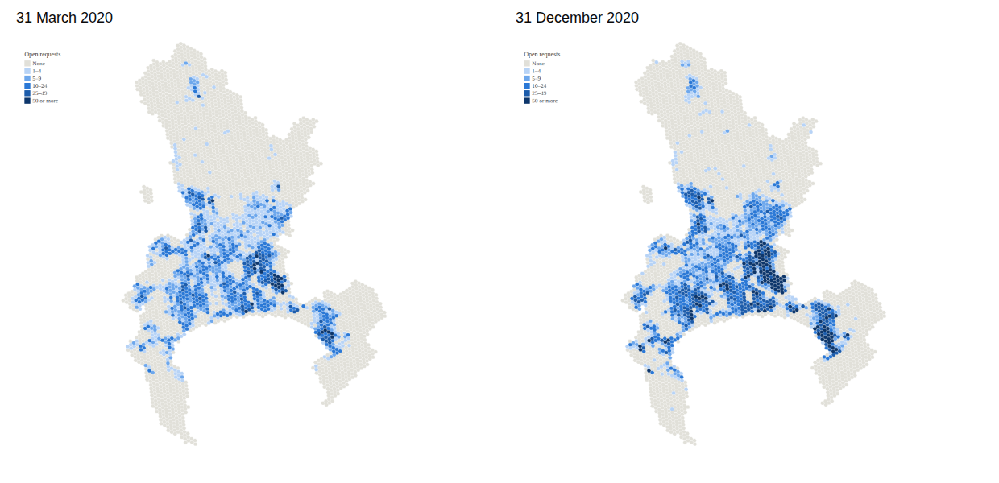

# Municipal Service Delivery BI

A Power BI dashboard for the Director of Water and Sanitation in a South African metro: where
open work is building up, when to call in contractors, and where operations are bottlenecked.
Its centrepiece is an **Operations Map** that highlights every location with open maintenance work
on a chosen date.

**Status: v1.0 in build.** The brief and spec are final, the data pipeline runs, the
Operations Map spec is render-tested, and the Power BI model is built and reconciled with the
pipeline's row counts; measures and report pages are next.



*Render test of the [Operations Map](powerbi/deneb/) outside Power BI.*

Planning artifacts are in `_bmad-output/`; this README is updated when something is real.

---

## The problem

From the [product brief](_bmad-output/planning-artifacts/briefs/brief-municipal-service-delivery-bi-2026-09-27/brief.md):

> A Water and Sanitation Director with a finite pool of field crews has to decide, week by week,
> when internal capacity is not enough and contractors must be called in, and which part of
> operations is holding work up. Backlog totals by department do not show where open work is
> building up or which jobs are stuck, so the call comes late or lands in the wrong place.

## Approach

| Concern | Choice |
|---|---|
| Method | [BMAD](https://github.com/bmad-code-org/BMAD-METHOD) v6.12.0 — Analysis → Planning → Solutioning → Implementation |
| Semantic model | Power BI Project (PBIP) with TMDL, version-controlled as text |
| Model authoring and testing | [Power BI Authoring MCP server](https://github.com/microsoft/powerbi-modeling-mcp) v1.0.0 — measures validated by DAX query against independently computed values |
| Data | Real, published municipal data: City of Cape Town service requests (941,634 requests created in 2020; see [data profile](docs/research/data-profile.md)), financials from National Treasury's Municipal Money. |
| Releases | Versioned (v1.0, v1.1, ...), each tagged with a changelog and a short retrospective |

## Repository layout

```
pipeline/               Download, scope, clean, star schema, reference values
MunicipalServiceDelivery.pbip
                        Power BI project; the semantic model is text (TMDL) in *.SemanticModel/
powerbi/deneb/          Operations Map spec, set-up guide and render test
powerbi/mcp-setup.md    Power BI Authoring MCP set-up with Claude Code
tests/                  pytest: cleaning rules, measure definitions, reconciliation
docs/                   Research notes, data profile, generated data-quality report
_bmad-output/           Brief, spec and later implementation artifacts (BMAD)
_bmad/, .claude/skills/ BMAD install for Claude Code
```

## Working on this repo

Requirements: [uv](https://docs.astral.sh/uv/) and, for the model and report, Power BI Desktop
on Windows.

```
uv run python -m pipeline.run   # downloads the City's data, writes data/processed/*.parquet
uv run pytest                   # cleaning rules, measure definitions, reconciliation
```

The pipeline takes about 20 seconds after the first download. Source data is published by the
City of Cape Town and is not stored in this repository. See the
[data-quality report](docs/data-quality-report.md) for what the cleaning keeps, flags and
quarantines.

### Opening the Power BI project

Run the pipeline first, then open `MunicipalServiceDelivery.pbip` in Power BI Desktop. Set the
`DataFolder` parameter (Transform data → Edit parameters) to your clone's `data\processed\`
folder, keeping the trailing backslash, and refresh. The committed value is a placeholder.

A git filter keeps your own folder path out of commits. Turn it on once per clone:

```
git config filter.datafolder.clean "sed -E -f powerbi/datafolder-clean.sed"
git config filter.datafolder.required true
```

Open the repo in Claude Code and run `/bmad-help` to see where the project is and what comes next.
