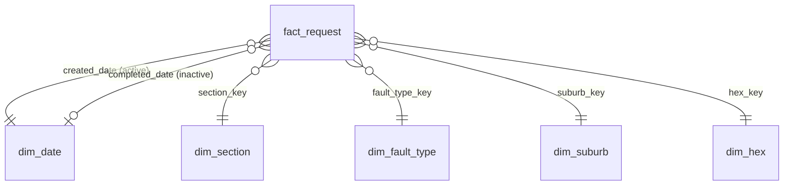

# Data model

Star schema produced by the pipeline and imported into Power BI.

`as_at` (dates of 2020) and `threshold` (what-if parameter) are **disconnected**. `quarantine` and
`dq_summary` stand alone for the transparency page.

## Tables

| Table | Grain | Key columns |
|---|---|---|
| `fact_request` | One clean in-scope request | `request_id` (notification number), `created_at`, `completed_at` (SAST), `created_date`, `completed_date`, `section_key`, `fault_type_key`, `suburb_key`, `hex_key`, `days_to_complete`, `is_admin_closure`, `is_likely_repeat`, `is_located` |
| `dim_date` | One day, 2020-01-01 to the last completion date | `date`, `week_start`, `month`, `quarter`, `is_2020` |
| `dim_section` | One section | `department`, `branch`, `section`; missing values → "Unassigned section" |
| `dim_fault_type` | One `code` | `code_group`, `code`, `is_informal_settlement` |
| `dim_suburb` | One official suburb | `suburb`; missing → "Unknown suburb" |
| `dim_hex` | One H3 level-8 hexagon | `hex_id`, `centroid_lat`, `centroid_lon`, `geometry` (GeoJSON, for the map); `0` → "Unlocated" |
| `as_at` | One day in 2020 | `as_at_date`, `as_at_end` (23:59:59 SAST) |
| `quarantine` | One quarantined request | source columns + `reason_code` |
| `dq_summary` | One rule | `rule`, `rows`, `action` |

## Rules

- Likely repeat: same `code`, same `hex_id` (located rows only) and same SAST creation day as an
  earlier request; the first report is not flagged.
- Admin closure: completed within 5 minutes (300 seconds) of creation.
- Quarantine reason codes: `NEGATIVE_DURATION`; `DUPLICATE_RECORD` (guard, expected 0).
